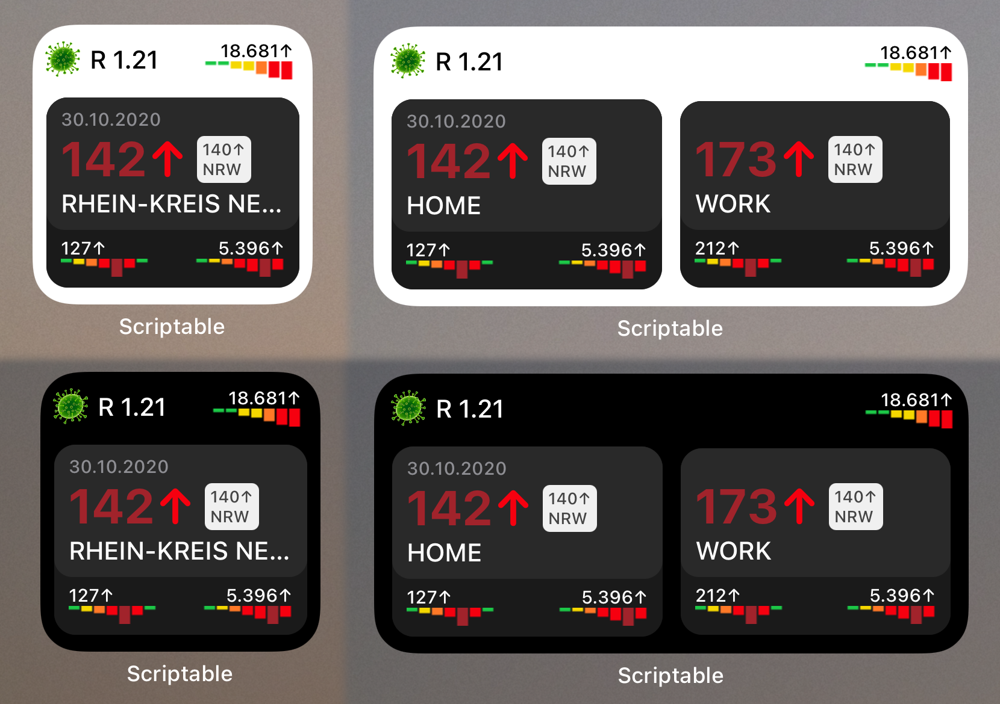
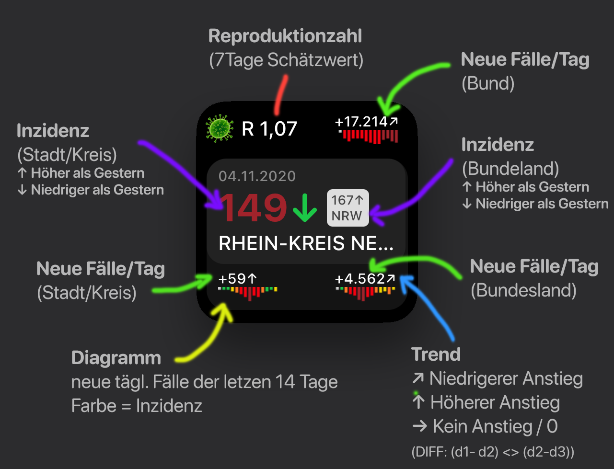

# Corona Inzidenz Widget für iOS (Scriptable)

* Auf grund der positiven Resonanz jetzt im Repo zur einfacheren Wartung/Erweiterung
* Mein original GIST: https://gist.github.com/rphl/0491c5f9cb345bf831248732374c4ef5

# Features

* Inzidenz + Trend für Stadt/Kreis, Bundesland
* `_Neue tägl. Fälle` für Stadt/Kreis, Bundesland, Bund
* Trend für `_Neue tägl. Fälle` je Stadt/Kreis, Bundesland, Bund
* 14 Tage Diagram für `Neue tägl. Fälle` je Stadt/Kreis, Bundesland, Bund
* 7 Tage Schätzwert für Reproduktionszahl (R)
* Offlinemodes
* Dark/Lighmode unterstützung

☕️ Einen Kaffee ausgeben 🙃: https://ko-fi.com/rapha

# Installation

 * ...
 * ...

# Konfiguration Inzidenz Widget

## Static Coordinates/MediumWidget

 * Set Widgetparameter for each column, seperated by ";" Format: `POSITION,LAT,LONG(,NAME);POSITION,LAT,LONG(,NAME)`
 * Second column is only visible if you set Widgetparameter for it. Check examples.

### Examples
 * First column is static (No second column): `0,51.1244,6.7353`
 * Second column is static (Second column is visble, MediumWidget): `1,51.1244,6.7353`
 * Both columns are static (both are visble, MediumWidget): `0,51.1244,6.7353;1,51.1244,6.7353`
 * Only second column is static (both are visble, MediumWidget): `1,51.1244,6.7353`
 
## Custom Names
 * Custom Name: `0,51.1244,6.7353,Home`
 * Custom Name Second column: `1,51.1244,6.7353,Work`

 ## Offlinemode

 * Set the 4th Widgetparameter to the CacheId 
 * Cache Id = Numeric JSON FileNumber. See coronaWidget CacheFolder
 
 * Examples:
 * Filename = coronaWidget01511.json
 * Config set to: 1,51.1244,6.7353,Work,01511
